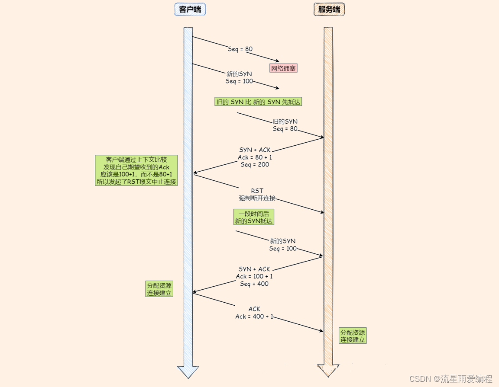

## post 和 get区别
- get 幂等请求，一般不对服务器资源影响
  post 不幂等，对服务器资源有影响
- get 请求参数在url中，post 请求参数在body中，post 请求参数在header中
- 安全，长度

## 304 多好吗？
- 搜索引擎蜘蛛，需要更新更加频繁的页面，304 减少被爬取的次数
## http 和 https 是持久化连接吗
- 持久化连接：一次tcp 连接，多次请求，响应，不用每次请求建立新连接
- http 1.1 默认启动持久化连接，http 1.0 默认关闭。服务器个客户端，通过connection: keep-alive 持久化，close 为关闭
- https 基于TCL/ssl 加密，默认启用
  因为需要额外TCL/ssl 握手，持久化性能提升
- http/2 支持多路复用multiplex（一个tcp 连接同时发生多个请求和响应，不用按顺序，**减少http** 队头阻塞）
## HTTP和HTTPS协议的区别
    HTTP和HTTPS协议的主要区别如下：
    ● HTTPS协议需要CA证书，费用较高；而HTTP协议不需要；
    ● HTTP协议是超文本传输协议，信息是明文传输的，HTTPS则是具有安全性的SSL加密传输协议；
    ● 使用不同的连接方式，端口也不同，HTTP协议端口是80，HTTPS协议端口是443；
    ● HTTP协议连接很简单，是无状态的；HTTPS协议是有SSL和HTTP协议构建的可进行加密传输、身份认证的网络协议，比HTTP更加安全。

## 为啥三次握手？
- **tcp连接**： 用于保证可靠性和流量控制维护的某些状态信息，包括socket、序列号、窗口大小
- 服务端先监听：TCP协议是一种面向连接的协议，建立连接需要经过三次握手。服务端必须先处于监听状态，才能接收客户端的SYN（同步）报文，进而开始三次握手过程。如果服务端不监听端口，客户端的连接请求将无法被接收，也就无法建立TCP连接。比如：一个Web服务器需要监听80端口（HTTP服务）或443端口（HTTPS服务），以便接收来自客户端的网页访问请求
- 原因：
  - 阻止重复李四连接的初始化（主要）(￣ェ￣;)
    发现网络阻塞后再发送syn包，得到确认好是之前的80，客户端回RST 报文，告诉服务器强制释放连接，旧报文丢弃
    两次握手：服务器第一次旧建立了连接，并且发送了数据，建立了一个历史连接，并且白发了数据
    
  - 同步双方初始系列号
    确定对方是否收到syn包，这样建立可靠传输，服务器发送syn+ack包，客户端收到后回复ack包，建立连接。
    两次握手，只保证一方初始化系列号被接收。
  - 避免资源阻塞
    两次握手：客户端syn报网络中阻塞，客户端没有收到ack 包，重新发送syn，服务器每次收到syn包主动建立一个连接
- 四次握手：三次理论已经够，第四次是服务器收到ack包，告诉客户端，可以开始通信了。不需要更多，不采用。
- 两次：无法阻止历史连接，造成双方资源浪费，无法得到可靠同步双方的序列号，不采用
- 每次tcp，序列号不一样：
  - 反正历史报文被下一个相同四元组连接接收（主）
  - 防止黑客伪造相同序列号的tcp报文