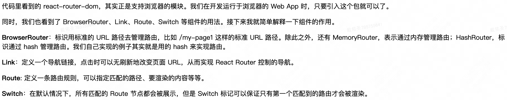

# 路由机制
- 让你的页面能够根据 URL 的变化进行页面的切换
- url 统一资源定位符，所以资源列表第几页，tab 页是什么等等都是要唯一
- 


## 定位 
- 一方面需要定位到当前展开的是哪个 Tab，同时还应该知道当前是表格的第几页，这样别人通过这个 URL 才能看到和你一样的内容

## 路由状态管理实现
```js
// 伪代码：URL 状态管理的 Tabs + Table 组件
export default () => {
  // 从 URL 路径参数获取当前 tab
  const { activeTab = "users" } = useParams();

  // 从查询字符串获取当前页码
  const page = parseInt(useSearchParam("page"), 10) || 1;

  // 获取路由操作对象
  const history = useHistory();

  // Tab 切换：更新 URL 路径
  const handleTabChange = useCallback(
    (tab) => history.push(`/TabsPage/${tab}`),
    [history]
  );

  // 分页配置：更新查询参数
  const pagination = {
    current: page,
    onChange: (p) => {
      history.push(`/TabsPage/${activeTab}?page=${p}`);
    }
  };

  return (
    <div>
      <Tabs activeKey={activeTab} onChange={handleTabChange}>
        <TabPane tab="用户" key="users">
          <Table dataSource={userData} pagination={pagination} />
        </TabPane>
        <TabPane tab="文章" key="posts">
          <Table dataSource={postData} pagination={pagination} />
        </TabPane>
      </Tabs>
    </div>
  );
};
```
- URL 状态管理的优势：
    URL 本身就是全局可访问的状态容器
    浏览器原生支持状态持久化和历史记录
    页面间通过 URL 直接传递状态，无需中间层
- 简单交互：
  - 搜索结果页面：URL 状态管理
  - 表单页面：表单状态管理
  - 数据筛选和排序