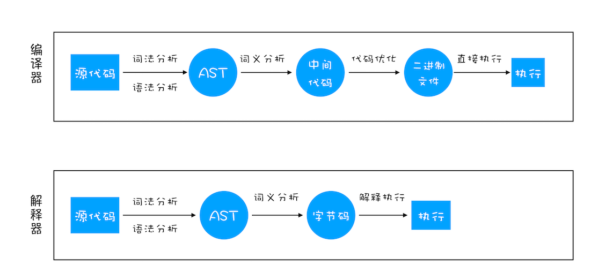

# rust 管理内存
## 内存自动还是手动管理
- 如果手工管理堆内存的话，堆上内存分配后忘记释放，就会造成内存泄漏。一旦有内存泄漏，程序运行得越久，就越吃内存，最终会因为占满内存而被操作系统终止运行。
- 如果堆上内存被多个线程的调用栈引用，该内存的改动要特别小心，需要加锁以独占访问，来避免潜在的问题。比如说，一个线程在遍历列表，而另一个线程在释放列表中的某一项，就可能访问野指针，导致堆越界（heap out of bounds）。而堆越界是第一大内存安全问题。
- 如果堆上内存被释放，但栈上指向堆上内存的相应指针没有被清空，就有可能发生使用已释放内存（use after free）的情况，程序轻则崩溃，重则隐含安全隐患
**多线程问题：像多人共用物品，需要排队或加锁避免冲突**
- rust 编译器，要求每个数据只有阳光主人，主人离开自动释放内存。
  不允许多个线程同时修改数据（除非明确加锁）
  如果你写了危险的代码，编译器会拒绝编译

## 编程概念：数据，代码，运行方式，编程范式
- 
- Babel的工作原理就是先将ES6源码转换为AST，然后再将ES6语法的AST转换为ES5语法的AST，最后利用ES5的AST生成JavaScript源代码
### AST（抽象语法树）构建
- 分词：其作用是将一行行的源码拆解成一个个token。所谓token，指的是语法上不可能再分的、最小的单个字符或字符串
- 语法分析：其作用是将tokens解析成AST
### 解释器Ignition就登场了，它会根据AST生成字节码
- 机器码：效率高，但是内存占用大
- 字节码就是介于AST和机器码之间的一种代码。但是与特定类型的机器码无关，字节码需要通过解释器将其转换为机器码后才能执行。
### 
虽然在V8诞生之初，也出现过一系列针对V8而专门优化JavaScript性能的方案，比如隐藏类、内联缓存等概念都是那时候提出来的。不过随着V8的架构调整，你越来越不需要这些微优化策略了，相反，对于优化JavaScript执行效率，你应该**将优化的中心聚焦在单次脚本的执行时间和脚本的网络下载上**，主要关注以下三点内容：
- 提升单次脚本的执行速度，`避免JavaScript的长任务霸占主线程`,
  可以使用使用时间切片等
- `避免大的内联脚本`，因为在解析HTML的过程中，解析和编译也会占用主线程；
  外部脚本文件，可以并行下载和解析
- `减少JavaScript文件的容量`，因为更小的文件会提升下载速度，并且占用更低的内存
  代码分割：按需加载；tree-shaking；压缩

### 微任务怎么出现的
- 如果DOM发生变化，采用同步通知的方式，会影响当前任务的执行效率；如果采用异步方式，又会影响到监控的实时性
- 为了平衡消息队列的 **‘效率’ 和 ‘实时性’**，
通常我们把消息队列中的任务称为宏任务，每个宏任务中都包含了一个微任务队列，在执行宏任务的过程中，
如果DOM有变化，那么就会将该变化添加到微任务列表中，这样就不会影响到宏任务的继续执行
- 

### 面向对象软件测试的四个层次
算法层：方法 (最小) 最小粒度，只测试一个方法
   ↓
类层：类内 (单个类) 测试同一个类中方法和属性的交互
   ↓  
模板层：类间 (多个类) 测试多个类之间的消息传递和协作，模版 模式 
   ↓
系统层：整体 (完整系统，最大) 包含所有子系统

### 哈夫曼编码
- 问题：{11,10,011,010,000} 不是哈夫曼树
- 判断一：
000、010、011都以0开头
但在二叉树中，以0开头意味着都在左子树
左子树要容纳3个长度为3的码字，需要特定的树结构
而10、11在右子树，只有2个长度为2的码字
这种不平衡的分布不符合哈夫曼树的特征
- 判断二：
        根
       /  \
      /    \
     左     右
    /      /  \
   左     左   右
  /      (10) (11)
 左
(000需要这个位置)
- 判断三：哈夫曼编码的本质是：高频字符用短码，低频字符用长码
如果000真的需要3位编码
那么011和010也是3位
但11和10只需要2位
这种分配方式在哈夫曼算法的构建过程中是不可能自然产生的！

### 归并排序 
- 每次把数组从中间一分为二，直到每个子数组只有1个元素
-  Kruskal算法是一种用于寻找加权无向图的最小生成树的算法。
它基于**贪心策略**，通过不断选择图中权重最小的边来构建最小生成树，同时避免形成环。
