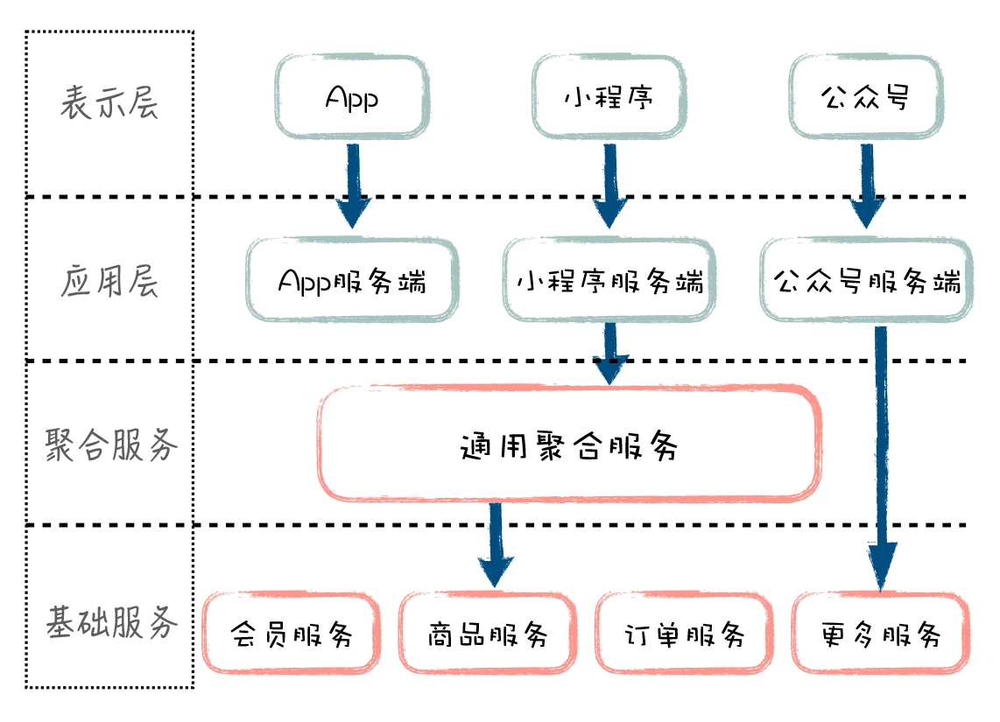
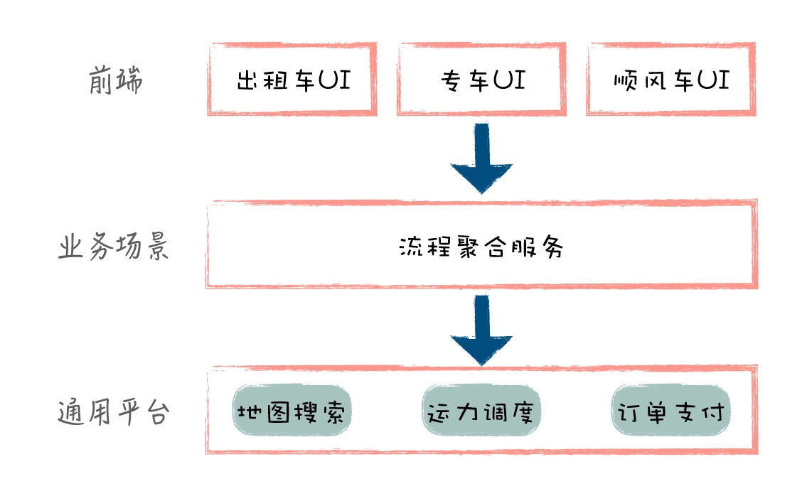

# 架构实践
- 系统架构（高级）
    微前端架构
    构建和部署流程
    监控和错误处理
    性能优化策略
- 有时间深入研究技术原理；能够持续实践和总结
  对新技术和概念接受度高；
- 架构的出发点是业务和技术在不断复杂化，引起系统混乱，需要通过架构来保证有序
- “分”就是把系统拆分为各个子系统、模块、组件
- “合”就是基于业务流程和技术手段，把各个组件有机整合在一起
## 流程
- 做架构设计时，一般是先考虑业务架构，再应用架构，最后是技术架构
- 业务，复杂度要求柔和可扩展
- 技术，也要满足系统的高可用、高性能和可伸缩，并尽量采用低成本的方式落地
- 架构师要有技术的广度（多领域知识）和深度（技术前瞻）
- 抽象，思维的深度，能够透过问题看本质
## 需求 产品经理与架构师
- 产品经理的工作，大量零散的原始需求经过梳理和关联，变成一系列有序的业务流程，以及流程里面的业务步骤（业务步骤也称之为业务节点），然后产品经理把这一系列的业务流程和业务节点以用户界面的方式定义出来，总的来说，产品经理定义了系统的外表
- 对业务架构师来说，TA的工作，就是把业务流程和节点打散，按照业务域的维度来划分系统模块，并定义这些模块之间的关系，最终形成一个高度结构化的模块体系
  例如：购物流程=商品模块.商品搜索+购物车模块.添加商品+订单模块.创建订单+支付模块.支付
- **业务的主题是变化和创新，系统的主题是稳定和可靠**
- 支付宝二代业务架构中，你会发现，他们在前后台业务线之间，构建了独立的支付清算平台，从而实现了前台业务和后台业务的解耦。
  在这里，不管前台业务，还是后台业务，都只需要对接中间的支付清算平台，把系统的变化收敛到一个点
- 清晰的模块定位和通用化设计，是模块能够复用的内在要求
- 划分层次：同样是订单业务域，对于底层订单的增删改查功能，不同类型的订单都是一样的，但对于上层的订单生命周期管理，外卖订单和堂食订单可能就不一样

## 系统：模块与关系
- 模块是系统的基本组成部分，它泛指子系统、应用、服务或功能模块。关系指模块之间的依赖关系
- 模块的业务逻辑尽量围绕自身内部数据进行处理，对外部依赖越小，模块的封装性越好，稳定性也越强，不会随着外部模块的调整而调整
- 模块的粒度要保持适中，不能为了追求定位清晰，把粒度划分得很小，导致系统的碎片化。比如系统早期的时候，一般我们把积分功能放到用户模块里面，不单独构建积分模块，如果后续积分的概念越来越突出，承载的业务越来越复杂，到时候可以把积分功能分离出来，单独成模块。
- `模块是单向的`,业务流程是有顺序的，如果模块依赖关系越直观地体现业务流程的顺序，越能帮助人理解，否则，我们会被双向的依赖箭头绕的晕头转向，很难通过模块之间的依赖关系还原实际业务的处理过程

## 通过拆分，实现模块划分；通过整合，优化模块依赖关系
### 拆分
- 系统进行模块化拆分，拆分有两种方式：**水平拆分(功能内聚)和垂直拆分(业务闭环)**
- 一般做业务架构时，我们先考虑垂直拆分，从大方向上，把不同业务给区分清楚，然后再针对具体业务，按照业务处理流程进行水平拆分
- 
### 整合
- **通用化和平台化**
- 在模块接口中，通过输入参数标识调用来自哪个业务，是出租车、快车还是顺风车，然后在模块内部，针对不同业务线的差异化部分做针对性处理
- 业务平台化是模块依赖关系层次化的一个特例，只是它偏向于基础能力，在实践中，当业务线很多，业务规则很复杂时，我们经常把底层业务能力抽取出来，进行平台化处理
