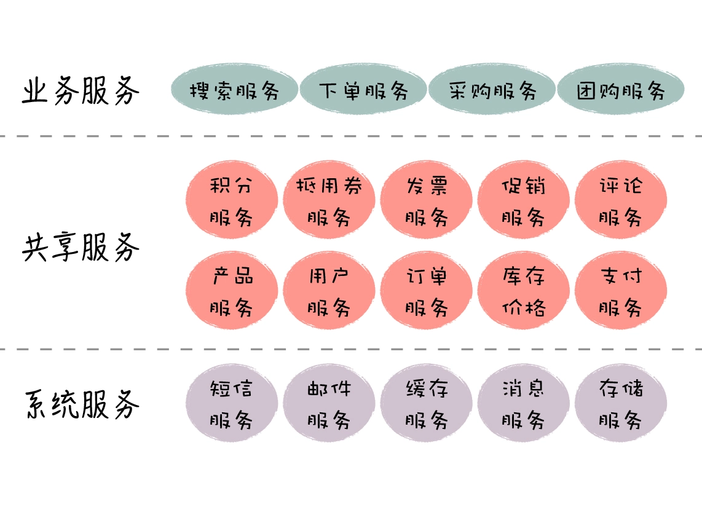
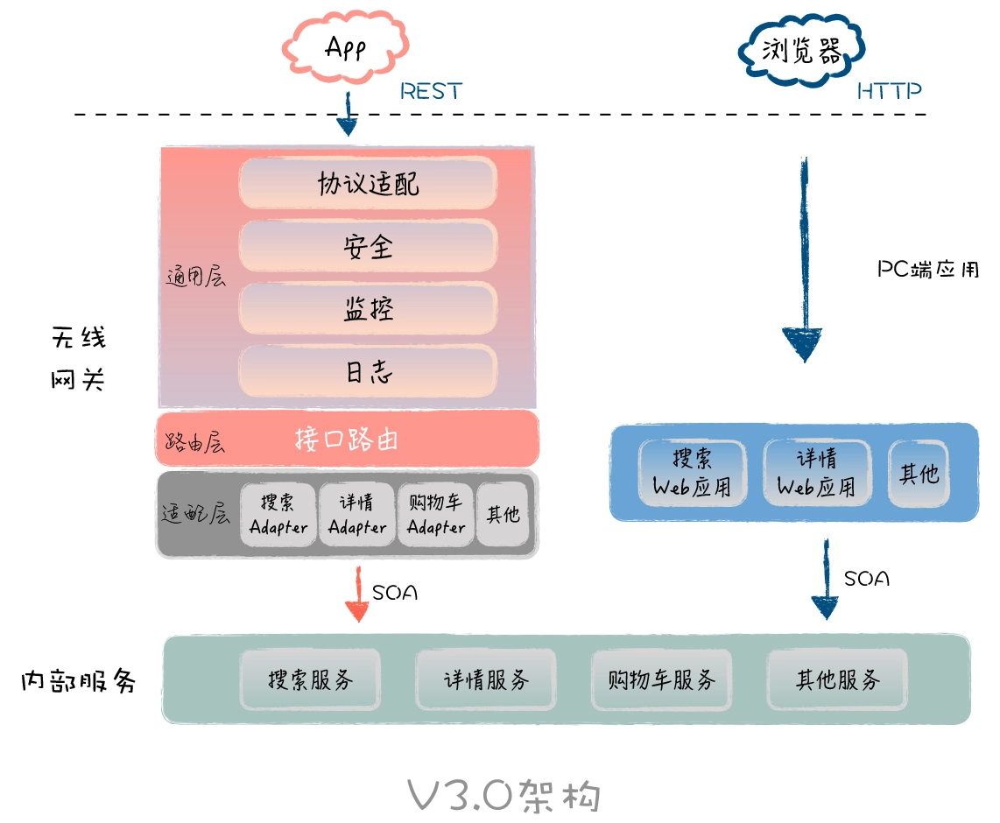
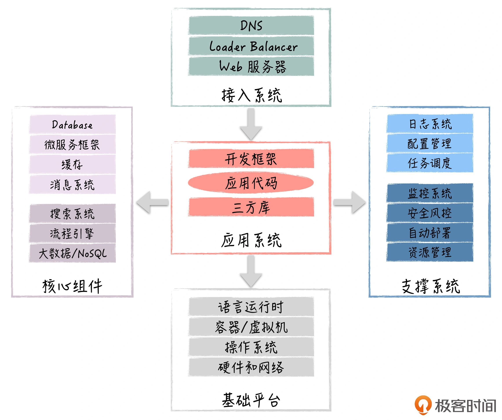

# 架构案例
## 电商架构 微服务
- 微服务概念的提出，一开始是用来和单体架构做区分的。我们知道，单体架构和分布式架构，实际上都是围绕一个大的业务线来构建应用，当业务变得复杂时，就无法做到模块边界和依赖关系的清晰划分，模块局部的调整往往会导致系统整体的调整，使得系统很难扩展。
- 而**微服务围绕更小的业务单元构建独立的应用**
- 每个微服务，都是负责端到端的业务，包括前端的UI展现部分和后端业务逻辑。微服务的团队成员可能包括产品、开发、测试、运维等人员，由这个小团队负责应用的整个生命周期管理
- 微服务强调围绕业务，进行清晰的业务和数据边界划分，并通过良好定义的接口输出业务能力，这和SOA架构里的服务有点类似。但两者不同的地方在于，*微服务是去中心化的，不需要SOA架构中ESB的集中管理方式*
- 微服务=小应用+小服务，一般**把系统核心的业务逻辑和数据封装成服务，其它部分还是以应用的方式落地**
- 封装底层基础业务的是共享微服务，封装流程的是聚合微服务，封装具体业务场景的服务端是应用微服务，封装基础中间件（如Redis缓存、消息推送）的是系统微服务

## 小店分层

- 适配器首先用来解决内外部接口的适配
- 这些适配器物理上是Jar包的形式，由各个业务线研发团队提供，所有的适配器会集中部署在网关，而网关本身可以支持多实例的部署，通过水平扩展的方式提升服务端的处理能力

## 中台 操作系统作用(中间层)，向下管理硬件，屏蔽各种硬件的差异和复杂性，向上提供简洁的API接口
- 前台(C端)要快，后台(企业内部)要稳
- 把各业务线中相同的核心逻辑抽取出来，通过抽象设计，实现通用化，共同服务于所有业务线的需求，系统结构整体上是一个“山”字型
- 结构：从上到下分别是通用聚合服务层、通用基础业务平台和通用中间件平台
- 从高到低，我们可以依次划分为产品复用>业务流程复用>业务实体复用>组件复用>代码复用
### 设计注意⚠️
- 通过**升级硬件和机器数量**来提升处理能力
- 架构设计要保证系统在业务高峰时，要能快速地增加资源来提升系统处理能力；反之，当业务低谷时，可以快速地减少系统资源，保证系统的低成本
- 系统大致包含哪些部分

- 软件引入对系统提出挑战：
  Redis集群的多节点，它解决了单节点处理能力问题，但同时也带来了新的问题，比如节点内部的网络有问题（即网络分区现象），集群的可用性就有问题；Redis数据的多副本，它解决了单台服务器故障带来的可用性问题，但同时也带来了数据的一致性问题