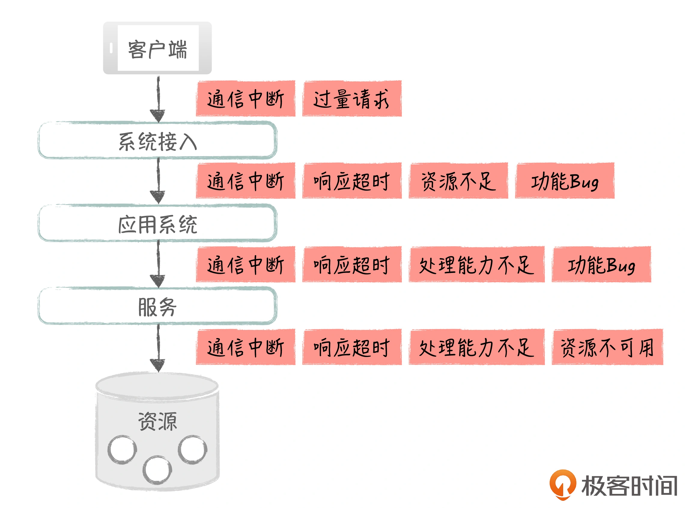

# 系统脆弱怎么高可用
- 系统的高可用真的很重要吗？如何实现系统的高可用，具体都有哪些手段呢？
用红色部分，标识出了整个处理过程中可能出现的故障点

- 可能问题：
 - 节点的功能有问题，API接口，中间件或者业务逻辑错误
 - 资源不可用，网络或者服务器故障，导致节点不可用
 - 资源不足，高并发时，节点不够，响应超时
## 应对策略：正面保障 和 减少损失
- 保证系统的各个节点在部署时是冗余的，没有单点。比如在接入层中，我们可以实现负载均衡的双节点部署，这样在一个节点出现问题时，另一个节点可以快速接管，继续提供服务
- 做到机房层面的冗余，通过系统的异地多IDC部署，解决自然灾害（如地震、火灾）导致的系统不可用问题
- 系统的可用性经常会和数据的一致性相互矛盾。在CAP理论中，系统的可用性、一致性和网络容错性，三个最多只能保证两个，在分布式系统的情况下，我们只能在C和A中选一个

- 一定要`监控系统`
- 无单点设计针对的是节点本身的故障，水平扩展针对的是节点处理能力的不足。
柔性事务和可降级是通过提供有损服务的方式来保证系统的可用性。柔性事务保证功能的基本可用和数据的最终一致，可降级通过损失非核心功能来保证核心功能的可用。

## 措施
客户端->接入层
客户端到服务端通常是远程访问，所以我们首先要解决网络的可用性问题。

针对网络的高可用，我们可以拉多条线路，比如在企业私有的IDC机房和公有云之间，同时拉移动和电信的线路，让其中一条线路作为备份，当主线路有问题时就切换到备份线路上。

在接入层，也有很多成熟的HA方案，比如说，你可以选择Nginx、HAProxy、LVS等负载均衡软件，它们都能很好地支持双节点+Keepalived部署。这样当一个节点出了问题，另一个节点就可以自动顶上去，而且两个节点对外是共享一个虚拟IP，所以节点的切换对外部是透明的。

这里，我们通过冗余和自动切换避免了单点的故障。

接入层->Web应用
Web应用通常是无状态的，我们可以部署多个实例，很方便地通过水平扩展的方式，提升系统的处理能力；接入层的负载均衡设备，可以通过各种算法进行多个Web实例的路由，并且对它们进行健康检测，如果某个实例有问题，请求可以转发到另一个实例进行处理，从而实现故障的自动转移。

通常情况下，我们还可以在接入层做限流，比如，在Nginx中设置每秒多少个并发的限制，超过这个并发数，Nginx就直接返回错误。

这里，我们同时支持了Web节点的水平扩展、自动故障转移以及系统的可降级（限流）。

Web应用->内部服务
服务通常也是无状态的，我们也可以通过部署多个实例进行水平扩展。

有多种方式可以支持服务实例的发现和负载均衡，比如说，我们可以使用传统的代理服务器方式，进行请求分发；另外，很多的微服务框架本身就支持服务的直接路由，比如在Spring Cloud中，我们就可以通过Eureka进行服务的自动注册和路由。

应用通常会访问多个服务，我们在这里可以做服务的隔离和熔断，避免服务之间相互影响。

比如在Spring Cloud的Hystrix组件（开源熔断框架）中，我们可以为不同服务配置不同的线程池，实现资源隔离，避免因为一个服务响应慢，而占用所有的线程资源；如果某个服务调用失败，我们可以对它进行熔断操作，避免无谓的超时等待，影响调用方的整体性能。

在应用和服务的内部，针对具体的功能，我们还可以做一些功能开关。开关实际上是一个标志变量，它的值可以是on/off， 我们在代码中可以根据它的值，来确定某一段逻辑是否要执行。开关的值可以在数据库或配置系统里定义，这样我们就能够通过外部的开关值，控制应用内部的行为，这个在eBay有大量的落地。

这里，我们同时支持了服务节点的水平扩展、自动故障转移以及系统的可降级（熔断和业务开关）。

访问基础资源
常见的资源包括关系数据库、缓存和消息系统，我就以它们为例来介绍一下。

关系数据库属于有状态服务，它的水平扩展没有那么容易，但还是有很多手段能够保障数据库的可用性和处理能力。

首先，我们可以做数据库的主从部署，一方面通过读写分离，提升数据库读的性能，减轻主库压力；另一方面，数据库有成熟的MHA方案，支持主库故障时，能够自动实现主从切换，应用可以通过VIP访问数据库，因此这个切换过程对应用也是透明的。

另外，我们也可以通过物理的水平分库方式，对数据进行分片，这样就有多个主库支持写入。水平分库会涉及较多的应用改造，后面会有一篇文章专门介绍1号店的订单水平分库项目，到时我们再详细讨论。

再说下缓存。在数据读写比很高的情况下，我们可以利用缓存优化数据库的访问性能，包括进程内部缓存和分布式缓存，缓存是应对高并发的有效武器。

很多缓存方案，比如Redis本身就支持集群方式，它可以通过多节点支持处理能力的水平扩展，通过数据的多副本来支持故障转移。

最后说下消息系统。消息系统有很多成熟的MQ组件，比如说Kafka，它可以通过多节点部署来支持处理能力的水平扩展，也能通过数据的多分区，实现故障的自动切换，保证系统的可用性。

最后我想说的是，明天和意外你永远不知道哪个先到来，即使有了这些高可用措施，还是会有各种各样的意外等待着我们。所以，系统的监控非常重要，只有准确地了解系统当前的状况，我们在面对问题时，才能快速响应，处理到点子上。