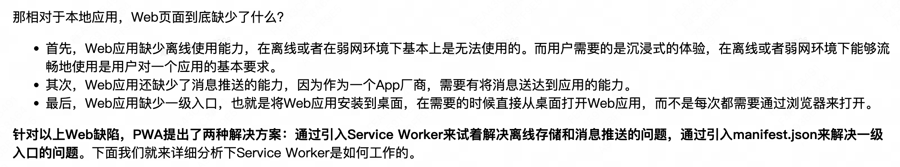

# PWA 渐进式

- 离线访问
- 推送通知
- 一级运行，不能每次都从浏览器打开吧，的是桌面吧
- 解决：
  通过引入Service Worker来试着解决离线存储和消息推送的问题，
  通过引入manifest.json来解决一级入口的问题
##  Service Worker
- 在没有安装Service Worker之前，WebApp都是直接通过网络模块来请求资源的。安装了Service Worker模块之后，WebApp请求资源时，会先通过Service Worker，让它判断是返回Service Worker 缓存的资源还是重新去网络请求资源

## Service Worker的设计思路
现在我们知道Service Worker的主要功能就是拦截请求和缓存资源，接下来我们就从Web应用的需求角度来看看Service Worker的设计思路。
1. 架构
通过前面页面循环系统的分析，我们已经知道了JavaScript和页面渲染流水线的任务都是在页面主线程上执行的，如果一段JavaScript执行时间过久，那么就会阻塞主线程，使得渲染一帧的时间变长，从而让用户产生卡顿的感觉，这对用户来说体验是非常不好的。
为了避免JavaScript过多占用页面主线程时长的情况，浏览器实现了Web Worker的功能。Web Worker的目的是让JavaScript能够运行在页面主线程之外，不过由于Web Worker中是没有当前页面的DOM环境的，所以在Web Worker中只能执行一些和DOM无关的JavaScript脚本，并通过postMessage方法将执行的结果返回给主线程。所以说在Chrome中，Web Worker其实就是在渲染进程中开启的一个新线程，它的生命周期是和页面关联的。
"让其运行在主线程之外"就是Service Worker来自Web Worker的一个核心思想。不过Web Worker是临时的，每次JavaScript脚本执行完成之后都会退出，执行结果也不能保存下来，如果下次还有同样的操作，就还得重新来一遍。所以Service Worker需要在Web Worker的基础之上加上储存功能。
另外，由于Service Worker还需要会为多个页面提供服务，所以还不能把Service Worker和单个页面绑定起来。在目前的Chrome架构中，Service Worker是运行在浏览器进程中的，因为浏览器进程生命周期是最长的，所以在浏览器的生命周期内，能够为所有的页面提供服务。
2. 消息推送
消息推送也是基于Service Worker来实现的。因为消息推送时，浏览器页面也许并没有启动，这时就需要Service Worker来接收服务器推送的消息，并将消息通过一定方式展示给用户。
3. 安全
基于Web应用的业务越来越多了，其安全问题是不可忽视的，所以在设计Service Worker之初，安全问题就被提上了日程。
关于安全，其中最为核心的一条就是HTTP。我们知道，HTTP采用的是明文传输信息，存在被窃听、被篡改和被劫持的风险，在项目中使用HTTP来传输数据无疑是"裸奔"。所以在设计之初，就考虑对Service Worker采用HTTPS协议，因为采用HTTPS的通信数据都是经过加密的，即便拦截了数据，也无法破解数据内容，而且HTTPS还有校验机制，通信双方很容易知道数据是否被篡改。
所以要使站点支持Service Worker，首先必要的一步就是要将站点升级到HTTPS。
除了必须要使用HTTPS，Service Worker还需要同时支持Web页面默认的安全策略、储入同源策略、内容安全策略（CSP）等。